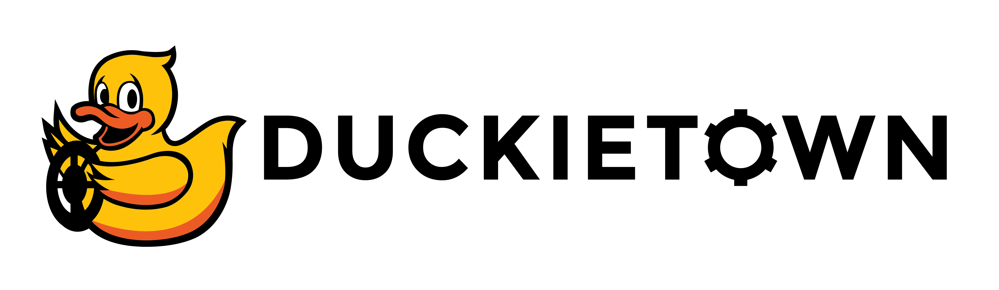
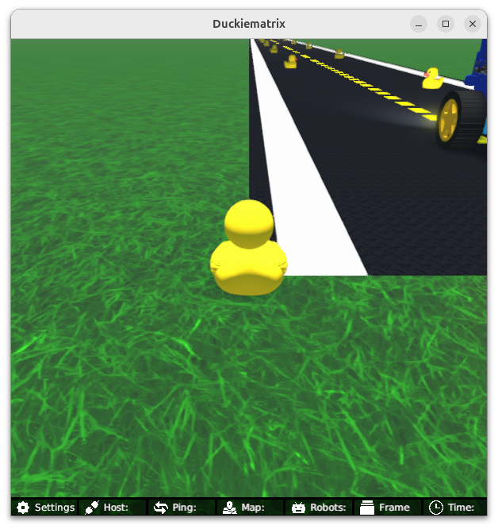
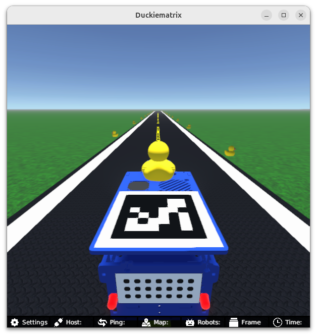

<p align="center">

</p>

# **Learning Experience (LX): Object Detection**

# About these activities

This learning experience will take you through the process of collecting data, automatically annotating it, 
and using this to train a neural network to perform object detection using the robot's camera image. We will then use this trained model
to ensure that we don't run over any duckie pedestrians in Duckietown. 
We will use one of the most popular object detection neural networks, called [YOLO (v11)](https://docs.ultralytics.com/models/yolo11/).
You will also have to integrate this trained model into a feedback controller so that we don't run over duckies. 
For now, we will just stop whenever an object (duckie) is detected in the road. 

This learning experience is provided by the Duckietown team and can be run on Duckiebots. Visit us at the 
[Duckietown Website](https://www.duckietown.com) for more learning materials, documentation, and demos.

For guided setup instructions, lecture content, and more related to this LX, 
see [our Self-Driving Cars with Duckietown MOOC on EdX](https://learning.edx.org/course/course-v1:ETHx+DT-01x+1T2025/home).

## Notes on Additional Accounts that you will require

**NOTE 1**: This LX will require you to have a Google account (we will use [Google Colab](https://colab.research.google.com/) and this will
require uploading data to your [Google Drive](https://drive.google.com/drive/)). 

**NOTE 2**: You will also need an account for [Hugging Face](https://huggingface.co). You can click the `Sign Up` button on the top right to create an account. Feel free to join the `Duckietown` organization when you get the verification step!

**NOTE 3**: In order to use the SAM3 model, you will have to request access by [filling out the request form](https://huggingface.co/facebook/sam3). This can take a few minutes for approval so if you do it now you will be approved by the time you get to the auto-labelling part. 

# Instructions

**(If not already done) Clone this repository**

The recommended way to use this repository is to make a fork and then clone that fork. 

This can be done through the GitHub web interface. However, you are also free to simply clone this repository and get started. 

Example instructions to fork a repository and configure to pull from upstream can be found in the 
[duckietown-lx repository README](https://github.com/duckietown/duckietown-lx/blob/mooc2022/README.md).


## 1. Make sure your LX is up-to-date

Update your exercise definition and instructions,

    git remote add upstream git@github.com:duckietown/lx-object-detection
    git pull upstream ente

## 2. Make sure your system is up-to-date

- 💻 This is an `ente` learning experience (note the branch name). Make sure your Duckietown Shell is set to an `ente` profile 
- (and not, e.g., a `daffy` one). You can check your current distribution with

    dts profile list

  To switch to an ente profile, follow the [Duckietown Manual DTS installation instructions](https://docs.duckietown.com/ente/duckietown-manual/10-setup/02-software/duckietown-shell-dts-installation.html#dt-account-switch-profile).


- 💻 Always make sure your Duckietown Shell is updated to the latest version. See [installation instructions](https://github.com/duckietown/duckietown-shell)

- 💻 Update the shell commands: `dts update`

- 💻 Update your laptop/desktop: `dts desktop update`

- 🚙 Update your Duckiebot: `dts duckiebot update ROBOTNAME` (where `ROBOTNAME` is the name of your Duckiebot - real or virtual.)

**Note**: if your virtual robot hangs indefinitely when you try to update it, you can try to restart it with:

    dts duckiebot virtual restart ROBOTNAME


## 3. Work on the exercise

### Launch the code editor

#### SSL certificate

If you have not done so already, set up your local SSL certificate needed to run the learning experience editor with:

    sudo apt install libnss3-tools
    dts setup mkcert


Open the code editor by running the following command,

```
dts code editor
```

Wait for a URL to appear on the terminal, then click on it or copy-paste it in the address bar
of your browser to access the code editor. The first thing you will see in the code editor is
this same document, you can continue there.

**NOTE**: if you are running Duckietown inside a devcontainer, make sure to [install the certificate for your host machine as well](https://docs.duckietown.com/ente/duckietown-manual/10-setup/setup-devcontainer.html#dts-code-run). 


### Walkthrough of notebooks

**NOTE**: You should be reading this from inside the code editor in your browser.

Inside the code editor, use the navigator sidebar on the left-hand side to navigate to the
`notebooks` directory and open the first notebook.

Follow the instructions on the notebook and work through the notebooks in sequence.


### Testing with the Duckiematrix

To test your code in the Duckiematrix you will need a virtual robot. You can create one with the command:

```
dts duckiebot virtual create --type duckiebot --configuration DB21J VBOT
```

where `VBOT` is the hostname. It can be anything you like, with [some constraints](https://docs.duckietown.com/ente/duckietown-manual/10-setup/03-duckiebot/flashing-sd-card-duckiebot-initialization-complete.html). Make sure to remember your robot (host)name for later.

Then you can start your virtual robot with the command:

```
dts duckiebot virtual start VBOT
```

You should see it with a status `Booting` and finally `Ready` if you look at `dts fleet discover`: 

```
     | Hardware |   Type    | Model |  Status  | Hostname 
---  | -------- | --------- | ----- | -------- | ---------
[VBOT] |  virtual | duckiebot | DB21J |  Ready   | [VBOT].local
```

Now that your virtual robot is ready, you can start the Duckiematrix. From a terminal in this exercise directory that you 
cloned do:

```
dts code start_matrix
```

You should see the Unity-based Duckiematrix simulator start up. The startup screen will look like:



Your Duckiebot is at the start of a long straightaway with duckies crossing the road. 

From here you can click anywhere on the window and click [ENTER] to make it become active. 
From here you can move the duckie towards the Duckiebot with the 'w', 'a', 's', and 'd' keys or you can move the 
camera angle to view the Duckiebot with the mouse. If you are close enough to your Duckiebot, you can jump on with the 'E' key, 
which should look like



You can then you can drive the Duckiebot around with the 'w', 'a', 's', and 'd' keys (which will be useful later for data collection).

If you get very lost from the road and you want to come back, you can do so with the 'R' key. 


### Building your code

You can build your code with 

```
dts code build -R ROBOT_NAME [--local]
```

This will build a docker image with your code compiled inside. 


**Note**: For the time being if `ROBOT_NAME` is a **real** Duckiebot, you should build with the `--local` flag. This
will cause the image to be built on your local machine rather than on the Duckiebot itself. 


### 💻 Testing 


To test your code by running:

```
dts code workbench [-m] -R ROBOT_NAME [--local]
```

You should include the `-m` if `ROBOT_NAME` is a virtual robot to indicate that you are running in the Duckiematrix.

**Note**: For the time being, you should include the `--local` flag if `ROBOT_NAME` is a **real** Duckiebot. This
will cause the code to be run on your laptop which is communicating with your Duckiebot. 


However, before you can test you will need to:

 - Collect data
 - Annotate that data (automatically)
 - Train your object detection model
 - Export your model


To get started you can proceed to the [first notebook](./notebooks/01-CNN/cnn.ipynb).

## Credits

The previous (daffy) version of this LX was largely written by [Charlie Gauthier](https://velythyl.github.io/). 

This updated (ente) version was largely written by [Shima Shahfar](https://ca.linkedin.com/in/shima-shahfar).
